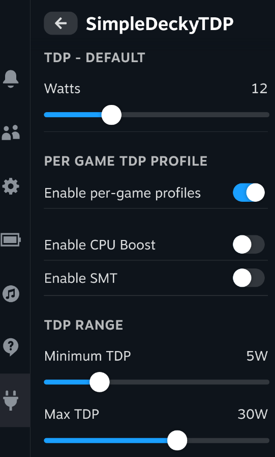
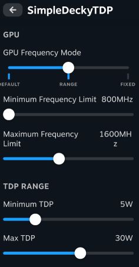

# SimpleDeckyTDP

This is a very simple Linux TDP Decky Plugin that wraps ryzenadj

- [Compatibility](#compatibility)
- [Requirements](#requirements)
- [Installation](#install)
  - [Prerequisites](#prerequisites)
  - [Quick Install / Update](#quick-install--update)
  - [Manual Install](#manual-install)
- [Manual Build](#manual-build)
- [Advanced Configuration](#advanced-configuration)
  - [Custom TDP Method](#custom-tdp-method)
  - [Custom Device Settings](#custom-device-settings)
- [Troubleshooting](#troubleshooting)




## Compatibility

Tested on ChimeraOS Stable (44-1 and 43-1), ChimeraOS 45 unstable, NobaraOS 39, and Bazzite Deck Edition.

Other distros not tested.

## Requirements

### WARNING: This plugin assumes you already have ryzenadj installed and can be located in your PATH

Note that ryzenadj is NOT necessary if you plan on either using a [ryzenadj override](#custom-tdp-method) or use a [custom device setting](#custom-device-settings). There is a custom device setting available for the Legion Go.

To check this, you can run `which ryzenadj` in a terminal/console, which should print out a path to a ryzenadj binary.

e.g.

```
$ which ryzenadj
/usr/bin/ryzenadj
```

If you do not have ryzenadj installed, you will need to get a working copy installed onto your machine.

To test your ryzenadj to make sure that it's functional, run the following:

```
$ sudo ryzenadj -i
```

This should print out a table that looks something like the following:

```
CPU Family: Rembrandt
SMU BIOS Interface Version: 18
Version: v0.13.0
PM Table Version: 450005
|        Name         |   Value   |     Parameter      |
|---------------------|-----------|--------------------|
| STAPM LIMIT         |     8.000 | stapm-limit        |
| STAPM VALUE         |     0.062 |                    |
```

If you see an error, you may need to set `iomem=relaxed` as a boot parameter for your kernel.

# Install

### Prerequisites

Decky Loader must already be installed.

### Quick Install / Update

Run the following in terminal, then reboot. Note that this works both for installing or updating the plugin

```
curl -L https://github.com/aarron-lee/SimpleDeckyTDP/raw/main/install.sh | sh
```

### Manual Install

Download the latest release from the [releases page](https://github.com/aarron-lee/SimpleDeckyTDP/releases)

Unzip the `tar.gz` file, and move the `SimpleDeckyTDP` folder to your `$HOME/homebrew/plugins` directory

then run:

```
sudo systemctl restart plugin_loader.service
```

then reboot your machine.

## Manual build

Dependencies:

- Node.js v16.14+ and pnpm installed
- fully functional ryzenadj

```bash
git clone https://github.com/aarron-lee/SimpleDeckyTDP.git

cd SimpleDeckyTDP

# if pnpm not already installed
npm install -g pnpm

pnpm install
pnpm update decky-frontend-lib --latest
pnpm run build
```

Afterwards, you can place the entire `SimpleDeckyTDP` folder in the `~/homebrew/plugins` directly, then restart your plugin service

```bash
sudo systemctl restart plugin_loader.service

sudo systemctl reboot
```

## Advanced configuration

### Custom TDP method

If you'd prefer to use something other than `ryzenadj` for to set TDP, you can opt to override ryzenadj with an alternative.

In the `$HOME/homebrew/settings/SimpleDeckyTDP/settings.json`, add an `overrideRyzenadj` value. Whatever value you set will be used as a command, with the tdp provided as a single additional arg

e.g.

```
# settings.json
{
    "overrideRyzenadj": "/path/to/script.sh",
    ...
}

# called later at app runtime, 15 = tdp value
/path/to/script.sh 15
```

You can see how it's used in the code [here](https://github.com/aarron-lee/SimpleDeckyTDP/blob/1ab6b6df468e983a1246ff378875bb2a370b5698/py_modules/cpu_utils.py#L18)

### Custom Device settings

See [device settings README](./py_modules/devices/README.md)

## Troubleshooting

### Buggy behavior after upgrading the plugin to a new version

If you see buggy behavior after upgrading to a new version of the plugin, it might be due to some bad values in an older settings file.

Try deleting the `$HOME/homebrew/settings/SimpleDeckyTDP/settings.json` file.

Note that this will delete any of your saved TDP profiles, so you could optionally copy it somewhere else to keep it as a backup instead.
