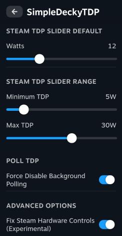

# SimpleDeckyTDP

This is a (formerly simple) Linux TDP Decky Plugin that wraps ryzenadj. Intended for devices compatible with ryzenadj.

- [Compatibility](#compatibility)
- [Requirements](#requirements)
- [Installation](#install)
  - [Prerequisites](#prerequisites)
  - [Quick Install / Update](#quick-install--update)
  - [Manual Install](#manual-install)
- [Manual Build](#manual-build)
- [Uninstall Instructions](#uninstall-instructions)
- [Advanced Configuration](#advanced-configuration)
  - [Custom TDP Method](#custom-tdp-method)
  - [Custom Device Settings](#custom-device-settings)
- [Troubleshooting](#troubleshooting)
- [Attribution](#attribution)




## Features

- per game TDP Profiles (and optional separate AC Power Profiles)
  - custom TDP limits
- Power Governor and Energy Performance Preference controls
- GPU Controls
- SMT control
- CPU Boost control\*
  - note, requires a AMD scaling driver that supports CPU boost, currently amd-pstate-epp doesn't support CPU Boost
- (optional) Fix Steam Client TDP and GPU Sliders
- set TDP on AC Power events and suspend-resume events
- TDP Polling - useful for devices that change TDP in the background
- Legion Go TDP via WMI calls (allows for TDP control with secure boot)
- ROG Ally TDP via WMI calls (allows for TDP control with secure boot)
- etc

## Compatibility

Tested on ChimeraOS Stable (45), NobaraOS 39, and Bazzite Deck Edition.

Other distros not tested.

Currently NOT compatible with Intel or Nvidia, this plugin is currently AMD APUs only

## Requirements

### WARNING: This plugin assumes you already have ryzenadj installed and can be located in your PATH

Note that ryzenadj is NOT necessary if you plan on using a [ryzenadj override](#custom-tdp-method).

ChimeraOS, Bazzite Deck Edition, and NobaraOS Deck edition, should already have ryzenadj pre-installed.

To check this, you can run `which ryzenadj` in a terminal/console, which should print out a path to a ryzenadj binary.

e.g.

```
$ which ryzenadj
/usr/bin/ryzenadj
```

If you do not have ryzenadj installed, you will need to get a working copy installed onto your machine.

To test your ryzenadj to make sure that it's functional, run the following:

```
$ sudo ryzenadj -i
```

This should print out a table that looks something like the following:

```
CPU Family: Rembrandt
SMU BIOS Interface Version: 18
Version: v0.13.0
PM Table Version: 450005
|        Name         |   Value   |     Parameter      |
|---------------------|-----------|--------------------|
| STAPM LIMIT         |     8.000 | stapm-limit        |
| STAPM VALUE         |     0.062 |                    |
```

If you see an error, you may need to set `iomem=relaxed` as a boot parameter for your kernel, or disable secure boot.

# Install

### Prerequisites

Decky Loader must already be installed. If using ryzenadj for TDP control, secure boot must be disabled.

### Quick Install / Update

Run the following in terminal, then reboot. Note that this works both for installing or updating the plugin

```
curl -L https://github.com/aarron-lee/SimpleDeckyTDP/raw/main/install.sh | sh
```

### BazziteOS installer

The Bazzite installer does extra steps so that steam-fix functionality can work

First install Decky Loader with:

```
ujust setup-decky
```

Then install SimpleDeckyTDP with:

```
ujust setup-decky simpledeckytdp

# old installer, if you're on an old version of BazziteOS
ujust get-simpledeckytdp
```

### Manual Install

Download the latest release from the [releases page](https://github.com/aarron-lee/SimpleDeckyTDP/releases)

Unzip the `tar.gz` file, and move the `SimpleDeckyTDP` folder to your `$HOME/homebrew/plugins` directory

then run:

```
sudo systemctl restart plugin_loader.service
```

then reboot your machine.

## Manual build

Dependencies:

- Node.js v16.14+ and pnpm installed
- fully functional ryzenadj

```bash
git clone https://github.com/aarron-lee/SimpleDeckyTDP.git

cd SimpleDeckyTDP

# if pnpm not already installed
npm install -g pnpm

pnpm install
pnpm update decky-frontend-lib --latest
pnpm run build
```

Afterwards, you can place the entire `SimpleDeckyTDP` folder in the `~/homebrew/plugins` directly, then restart your plugin service

```bash
sudo systemctl restart plugin_loader.service

sudo systemctl reboot
```

### Uninstall Instructions

In Desktop mode, run the following in terminal:

```bash
sudo rm -rf $HOME/homebrew/plugins/SimpleDeckyTDP
sudo systemctl restart plugin_loader.service
```

## Advanced configuration

### Custom TDP method

If you'd prefer to use something other than `ryzenadj` for to set TDP, you can opt to override ryzenadj with an alternative.

In the `$HOME/homebrew/settings/SimpleDeckyTDP/settings.json`, add an `overrideRyzenadj` value. Whatever value you set will be used as a command, with the tdp provided as a single additional arg

e.g.

```
# settings.json
{
    "overrideRyzenadj": "/path/to/script.sh",
    ...
}

# called later at app runtime, 15 = tdp value
/path/to/script.sh 15
```

You can see how it's used in the code [here](https://github.com/aarron-lee/SimpleDeckyTDP/blob/1ab6b6df468e983a1246ff378875bb2a370b5698/py_modules/cpu_utils.py#L18)

### Custom Device settings

See [device settings README](./py_modules/devices/README.md)

## Troubleshooting

### TDP Control is not working

First try updating the plugin to the latest version.

```
# update script
curl -L https://github.com/aarron-lee/SimpleDeckyTDP/raw/main/install.sh | sh
```

If this doesn't fix your issue, next try deleting your `$HOME/homebrew/settings/SimpleDeckyTDP/settings.json` file, and rebooting.

If neither works, please create a github issue.

### Buggy behavior after upgrading the plugin to a new version

If you see buggy behavior after upgrading to a new version of the plugin, it might be due to some bad values in an older settings file.

Try deleting the `$HOME/homebrew/settings/SimpleDeckyTDP/settings.json` file.

Note that this will delete any of your saved TDP profiles, so you could optionally copy it somewhere else to keep it as a backup instead.

### Steam GPU slider does not appear with the "Fix Steam Hardware Controls" enabled

If the Steam GPU Slider does not show up, this is an OS bug. SimpleDeckyTDP has no control over the GPU slider showing up, the plugin can only modify it.

If you encounter this issue, turn off `Fix Steam Hardware Controls` and use the GPU slider in the SimpleDeckyTDP plugin.

### My eGPU is being affected by TDP settings

The Steam GPU slider reportedly affects eGPUs, if you are using an eGPU you should disable the `Fix Steam Hardware Controls` toggle.

You will also have to manually disable the GPU control toggle and TDP toggle in the Steam QAM, since it can still affect GPU clocks even if SimpleDeckyTDP is no longer managing the Steam Sliders.

### Steam TDP slider and GPU Slider not working consistently with the "Fix Steam Hardware Controls" enabled

There's a few possibilities:

1. The Steam Client recently updated and broke the patch functionality of the plugin.
2. Your OS/Distro has a polkit file that is interfering with setting TDP/GPU values. This is a known issue on NobaraOS

For possibility #1, you can disable the `Fix Steam Hardware Controls` toggle, and instead use the TDP + GPU sliders in the plugin

For possibility #2, you can either enable polling to workaround the polkit file, or ask your distro maintainer to patch/update the polkit file.

### Are there CPU boost controls?

CPU Boost controls require a scaling-driver that supports CPU boost. Many distros, by default, use `amd-pstate-epp` as the scaling driver. This current does NOT support CPU boost controls.

If you need CPU boost controls, you should investigate changing your default scaling driver to `amd-pstate = passive` or `acpi-cpufreq`.

# Attribution

Thanks to the following for making this plugin possible:

- [hhd-adjustor](https://github.com/hhd-dev/adjustor/)
- [hhd-hwinfo](https://github.com/hhd-dev/hwinfo)
- [decky loader](https://github.com/SteamDeckHomebrew/decky-loader/)
- [ryzenadj](https://github.com/FlyGoat/RyzenAdj)

<!-- [](https://github.com/aarron-lee/SimpleDeckyTDP/releases) [](https://github.com/aarron-lee/SimpleDeckyTDP/releases/latest) [](https://github.com/aarron-lee/SimpleDeckyTDP/releases/latest) -->
