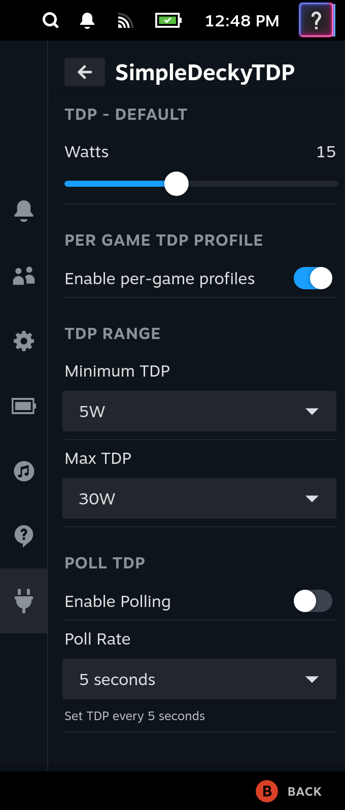

# SimpleDeckyTDP

This is a very simple Linux TDP Decky Plugin that wraps ryzenadj



## Requirements

### WARNING: This plugin assumes you already have ryzenadj installed and can be located in your PATH

ChimeraOS and Bazzite Deck Edition should already have ryzenadj installed.

However, Bazzite may require you to configure `iomem=relaxed` as an additional kernel parameter.

To check this, you can run `which ryzenadj` in a terminal/console, which should print out a path to a ryzenadj binary.

e.g.

```
$ which ryzenadj
/usr/bin/ryzenadj
```

If you do not have ryzenadj installed, you will need to get a working copy installed onto your machine.

To test your ryzenadj to make sure that it's functional, run the following:

```
$ sudo ryzenadj -i
```

This should print out a table that looks something like the following:

```
CPU Family: Rembrandt
SMU BIOS Interface Version: 18
Version: v0.13.0 
PM Table Version: 450005
|        Name         |   Value   |     Parameter      |
|---------------------|-----------|--------------------|
| STAPM LIMIT         |     8.000 | stapm-limit        |
| STAPM VALUE         |     0.062 |                    |
```

If you see an error, you may need to set `iomem=relaxed` as a boot parameter for your kernel.

# Install

Download the latest release from the [releases page](https://github.com/aarron-lee/SimpleDeckyTDP/releases)

Unzip the `tar.gz` file, and move the `SimpleDeckyTDP` folder to your `$HOME/homebrew/plugins` directory

then run:

```
sudo systemctl restart plugin_loader.service
```

then reboot your machine.

## Manual build

Dependencies:

- Node.js v16.14+ and pnpm installed
- fully functional ryzenadj

```bash
git clone https://github.com/aarron-lee/SimpleDeckyTDP.git

cd SimpleDeckyTDP

# if pnpm not already installed
npm install -g pnpm

pnpm install
pnpm update decky-frontend-lib --latest
pnpm run build
```

Afterwards, you can place the entire `SimpleDeckyTDP` folder in the `~/homebrew/plugins` directly, then restart your plugin service

```bash
sudo systemctl restart plugin_loader.service

sudo systemctl reboot
```
