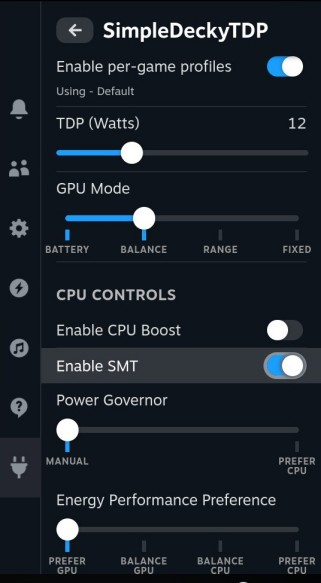

# SimpleDeckyTDP

[](https://github.com/aarron-lee/SimpleDeckyTDP/releases)

This is a Linux TDP Decky Plugin with support for AMD and experimental Intel support

- [Features](#features)
- [Compatibility](#compatibility)
- [Requirements](#requirements)
- [Installation](#install)
  - [Prerequisites](#prerequisites)
  - [Quick Install / Update](#quick-install--update)
  - [SteamOS Installation](#steamos-installation)
  - [Manual Install](#manual-install)
- [Manual Build](#manual-build)
- [Uninstall Instructions](#uninstall-instructions)
- [Advanced Configuration](#advanced-configuration)
  - [Desktop App](#desktop-app)
  - [Custom Device Settings](#custom-device-settings)
  - [CPU Boost Controls](#are-there-cpu-boost-controls)
- [Troubleshooting](#troubleshooting)
  - [Steam Deck Troubleshooting](#steam-deck-troubleshooting)
  - [ROG Ally Troubleshooting](#rog-ally-troubleshooting)
  - [Ryzenadj Troubleshooting](#ryzenadj-troubleshooting)
- [Attribution](#attribution)



## Features

- per game TDP Profiles (and optional separate AC Power Profiles)
  - custom TDP limits
- Power Governor and Energy Performance Preference controls
- GPU Controls
  - GPU Controls are not available on Intel
- SMT control
- CPU Boost control\*
  - note, AMD devices require a newer kernel for CPU boost controls
  - CPU boost controls appear automatically if it's available
- set TDP on AC Power events and suspend-resume events
- TDP Polling - useful for devices that change TDP in the background
- Desktop App - see [Desktop App Section](#desktop-app) for more details
- Legion Go TDP via WMI calls (allows for TDP control with secure boot)
- ROG Ally TDP via WMI calls (allows for TDP control with secure boot)
- (For ROG Ally) Battery Charge Limit
- etc

## Compatibility

Tested on SteamOS, ChimeraOS, NobaraOS, SteamFork, and Bazzite.

Other distros not tested. Intel support is experimental and still a work in progress.

Currently NOT compatible with Nvidia or other discrete GPU systems, this plugin is currently for APUs only

## Requirements

### AMD

This plugin builds + ships ryzenadj for TDP control, but will prioritize any pre-installed ryzenadj binary that can be located in your PATH. ChimeraOS, Bazzite Deck Edition, and NobaraOS Deck edition, should already have ryzenadj pre-installed.

Certain devices, such as the Steam Deck, Legion Go + S, ROG Ally, and Ally X, do not need ryzenadj for TDP control.

### Intel (experimental)

Intel support was built for the `intel_pstate` scaling driver, and is still an experimental work in progress.

To check if your system is compatible, run the following in terminal:

```bash
cat /sys/devices/system/cpu/cpufreq/policy*/scaling_driver
```

If the scaling is `intel_pstate`, then your device should be compatible

# Install

### Prerequisites

Decky Loader must already be installed.

### Quick Install / Update

Run the following in terminal, then reboot. Note that this works both for installing or updating the plugin

```
curl -L https://github.com/aarron-lee/SimpleDeckyTDP/raw/main/install.sh | sh
```

### Manual Install

Download the latest release from the [releases page](https://github.com/aarron-lee/SimpleDeckyTDP/releases)

Unzip the zip file, and move the `SimpleDeckyTDP` folder to your `$HOME/homebrew/plugins` directory

then run:

```
sudo systemctl restart plugin_loader.service
```

## Manual build

Dependencies:

- Node.js v16.14+ and pnpm installed
- fully functional ryzenadj

```bash
git clone https://github.com/aarron-lee/SimpleDeckyTDP.git

cd SimpleDeckyTDP

# if pnpm not already installed
npm install -g pnpm

pnpm install
pnpm update @decky/ui --latest
pnpm run build
```

Afterwards, you can place the entire `SimpleDeckyTDP` folder in the `~/homebrew/plugins` directly, then restart your plugin service

```bash
sudo systemctl restart plugin_loader.service
```

### Uninstall Instructions

In Desktop mode, run the following in terminal:

```bash
sudo rm -rf $HOME/homebrew/plugins/SimpleDeckyTDP
sudo systemctl restart plugin_loader.service
```

## Advanced configuration

### Desktop App

(Experimental) [SimpleDeckyTDP-Desktop App](https://github.com/aarron-lee/SimpleDeckyTDP-Desktop) - Desktop port of SimpleDeckyTDP

Intel support is still a work in progress for the Desktop app

- Note: the Desktop app does not have full feature parity with the Decky Plugin. Certain features cannot be implemented yet, such as:
  - per-game profiles
  - AC Profiles (in the Desktop app, AC Profiles are only supported on select devices)
  - etc

The Desktop App also should not be used simultaneously with the SimpleDeckyTDP decky plugin, you should only use one or the other at any given time.

This is because 2-way communication between the plugin and Desktop app is currently not possible.

### Are there CPU boost controls?

Note, CPU Boost should generally be disabled for the ROG Ally and Ally X, CPU boost is known to cause excessive power draw on the Ally and Ally X

CPU Boost controls require a scaling-driver that supports CPU boost. Many distros, by default, use `amd-pstate-epp` as the scaling driver. You must be on a newer kernel for to get CPU Boost controls on `amd-pstate-epp`

CPU boost controls will appear automatically if they're available

If you previously changed to amd_pstate=passive for to get CPU boost controls on BazziteOS, you can revert it via the following:

```
rpm-ostree kargs --delete-if-present=amd_pstate=passive
```

## Troubleshooting

### TDP Control is not working

First try updating the plugin to the latest version.

```
# update script
curl -L https://github.com/aarron-lee/SimpleDeckyTDP/raw/main/install.sh | sh
```

If this doesn't fix your issue, next try deleting your `$HOME/homebrew/settings/SimpleDeckyTDP/settings.json` file, and rebooting.

If neither works, please create a github issue.

### Buggy behavior after upgrading the plugin to a new version

If you see buggy behavior after upgrading to a new version of the plugin, it might be due to some bad values in an older settings file.

Try deleting the `$HOME/homebrew/settings/SimpleDeckyTDP/settings.json` file.

Note that this will delete any of your saved TDP profiles, so you could optionally copy it somewhere else to keep it as a backup instead.

### My eGPU is being affected by TDP settings

The Steam GPU slider reportedly affects eGPUs, if you are using an eGPU you should disable Steam's GPU toggle.

### Steam Deck troubleshooting

Valve changed the scaling driver from `acpi-cpufreq` to `amd-pstate-epp` in SteamOS version 3.7.5.

This change reportedly causes issues with EPP and CPU boost controls if you already had SDTDP installed. The solution is to fully reset the SDTDP settings via deleting the settings file.

NOTE: this will reset any per-game profiles you have previously made.

```bash
# run this to remove the old settings.json
rm $HOME/homebrew/settings/SimpleDeckyTDP/settings.json
```

### ROG Ally Troubleshooting

The ROG ally has some known issues related to CPU Boost and SMT.

- Suspend often gets borked if you disable SMT
  - SDTDP ships a workaround for the SMT bug on the Ally and Ally X, where it will temporarily turn on SMT before suspend
- CPU boost is reportedly misconfigured on the Ally and causes excessive power usage, disabling CPU boost is recommended

#### Rog Ally Extreme Power Save (aka MCU Powersave)

After enabling Extreme Powersave mode (aka MCU powersave), make sure you're on the latest MCU firmware (319 if original ROG Ally, 314 for the Ally X).

If you encounter issues with suspend, or back buttons not working after suspend-resume, it is likely due to your MCU firmware not being up to date, or your distro shipping old Asus-linux kernel modules.

### Legion Go Troubleshooting

The Legion Go requires using Lenovo's built-in WMI methods for device stability.

This use the Legion Go driver that adds TDP controls in the kernel.

This should also work for the Legion Go S.

### Ryzenadj troubleshooting

Note, SimpleDeckyTDP now ships it's own bundled ryzenadj, but by default the plugin will try to use ryzenadj that is already on the system. if `which ryzenadj` in terminal outputs a value, that will be used by the plugin.

The bundled ryzenadj can be found at `$HOME/homebrew/plugins/SimpleDeckyTDP/bin/ryzenadj`

To test your ryzenadj, try the following:

```
$ sudo ryzenadj -a 14000 -b 14000 -c 14000
```

the command above sets 14W TDP. You should see the following if sucessful:

```
Sucessfully set stapm_limit to 14000
Sucessfully set fast_limit to 14000
Sucessfully set slow_limit to 14000
```

If you don't see the success messages, your ryzenadj is most likely not working or configured for your device.

You can also test by running the following:

```
$ sudo ryzenadj -i
```

This should print out a table that looks something like the following:

```
CPU Family: Rembrandt
SMU BIOS Interface Version: 18
Version: v0.13.0
PM Table Version: 450005
|        Name         |   Value   |     Parameter      |
|---------------------|-----------|--------------------|
| STAPM LIMIT         |     8.000 | stapm-limit        |
| STAPM VALUE         |     0.062 |                    |
```

If you see an error, you may need to set `iomem=relaxed` as a boot parameter for your kernel, or disable secure boot.

Note that if you have SELinux + early lockdown enabled, ryzenadj will not work when trying to set TDP.

For Bazzite users, you can enable `iomem=relaxed` via running the following:

```bash
# for Bazzite users
rpm-ostree kargs --append-if-missing=iomem=relaxed
```

If you later want to remove the karg, run:

```bash
# for Bazzite users
rpm-ostree kargs --delete-if-present="iomem=relaxed"
```

# Attribution

Thanks to the following for making this plugin possible:

- [PowerControl](https://github.com/mengmeet/PowerControl/)
- [hhd-adjustor](https://github.com/hhd-dev/adjustor/)
- [hhd-hwinfo](https://github.com/hhd-dev/hwinfo)
- [decky loader](https://github.com/SteamDeckHomebrew/decky-loader/)
- [ryzenadj](https://github.com/FlyGoat/RyzenAdj)

As well as a big shoutout to SteamFork folks for troubleshooting and testing Intel support
