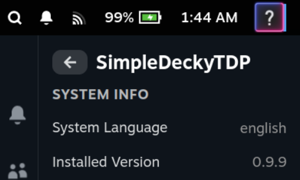

# How To Add a Language

## For Non-Developers

Please open a Github issue with the following information:

1. Your System language

You can find out your system language in the plugin:

2. Translations for your language, you can find examples in the [i18n folder](../defaults/i18n/).

e.g. [Template for Translations](../defaults/i18n/template.json)

3. Name for to add to the language metadata, see examples [here](../defaults/i18n/language_metadata.json)

## For Developers

Please Open a PR, required instructions are listed below:

1. In SimpleDeckyTDP, scroll down to the bottom and find your system language. It will look like the following:

2. Update the `steam_language_map.json` file, convert the system language to a [standard language code](https://en.wikipedia.org/wiki/List_of_ISO_639_language_codes)

3. Update the `language_metadata.json` file for your language.

4. in the `defaults/i18n` directory, add a json file for your language. Name the json file after the standard language code

e.g. [template.json](../defaults/i18n/template.json)
