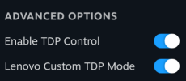

# Custom Device settings

## Experimental Custom TDP method for the Legion Go

This method, once enabled, will use Lenovo's built-in Custom TDP mode.

Note that this requires the `acpi_call` module, if your distro doesn't have it pre-installed, it'll have to be manually installed.

To check if you have `acpi_call`, run `sudo modprobe acpi_call` in terminal. You should see no errors.

This also requires the v28 or newer bios.

### Setup Instructions:

Make sure you have the latest SimpleDeckyTDP installed, and enable STAMP in the bios.

install/update to latest SimpleDeckyTDP with: `curl -L https://github.com/aarron-lee/SimpleDeckyTDP/raw/main/install.sh | sh`

If your device is compatible, enable the `Lenovo Custom TDP Mode` advanced setting in options:

You'll know it's working if it changes the power LED to purple when you set TDP via plugin

## Extra options for the ROG Ally

The ROG Ally has two extra options:

- Enable Platform Profile Management
- Enable TDP via Asus WMI

Platform Profile Management helps the Ally auto-manage fans

Asus WMI enables TDP control even with Secure Boot enabled

For anybody that needs more fine-grained fan control on the ROG Ally, I'd recommend the [PowerControl Decky Plugin](https://github.com/mengmeet/PowerControl), but note that it conflicts with SimpleDeckyTDP, so you'd need to uninstall it.

As an alternative that is compatible with SimpleDeckyTDP, there is a fan-curve-only fork of PowerControl I created for personal use on my GPD devices [found here](https://github.com/aarron-lee/PowerControl) Other users have reported that it works on the ROG Ally
